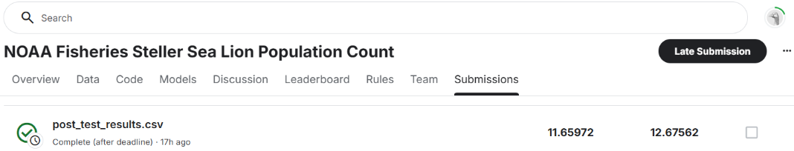

# NYCU Selected Topics in Visual Recognition using Deep Learning Final Project
Group: weak baseline

Student ID: 111550061 111550066 111550089 111550098

Name: 邱冠崴 王裕昕 李宗諺 楊宗儒

## Introduction
Steller sea lions in the western Aleutian Islands have undergone a dramatic population decline of approximately 94% over the past 30 years. To monitor their recovery, researchers at NOAA Fisheries' Alaska Fisheries Science Center conduct annual aerial surveys, capturing thousands of high-resolution images of sea lion rookeries and haulouts. Currently, trained biologists manually annotate and count sea lions in these images — a time-consuming task that can take up to four months to complete.

The goal of this project is to develop an automated system for accurately counting sea lions in aerial imagery, thereby reducing the time and human effort required for population monitoring.

This assignment focuses on building a model to estimate the number of sea lions in each image. The final predictions must be saved in a .csv file, reporting the count of sea lions in each class, and submitted to Kaggle for evaluation using Root Mean Square Error (RMSE).


## Method Overview
Our approach follows a two-stage pipeline:


1. Semantic Segmentation (UNet + SE blocks)
We first train a UNet-based model with SE blocks to perform pixel-wise multi-class segmentation of five sea lion categories: adult males, subadult males, adult females, juveniles, and pups. This model learns from training images annotated with sparse point labels, which are expanded into circular blobs to construct ground-truth masks.


2. Regression (Extra Trees, XGBoost)
After segmentation, we use the trained UNet to generate per-class probability maps on unseen data. From these maps, we extract patches and compute features such as pixel sums and blob counts. These features are used to train regression models that predict the number of sea lions in each class. During inference, the UNet generates the probability maps for test images, and the regressors predict the class-wise counts, which are saved to a .csv file for submission.


## How to install
### 1. Clone the Repository 
Begin by cloning the repository to your local machine and navigating to the project directory:  
```bash 
git clone https://github.com/GuanWei926/Selected-Topics-in-Visual-Recognition-using-Deep-Learning.git   
cd Selected-Topics-in-Visual-Recognition-using-Deep-Learning/Final_Project
```

### 2. Download the dataset 
Go to the following website to download the required dataset.
Kaggle website: https://www.kaggle.com/competitions/noaa-fisheries-steller-sea-lion-population-count/data

### 3. Install Dependencies  
Install the required dependencies by re-create the environment:    
```bash 
conda env create -f environment.yaml 
```

## How to execute
Download training and testing data (Test, Train, TrainDotted) and place it in ./data folder so it looks like this:
```bash
data
├── coords-threeplusone-v0.4.csv
├── MismatchedTrainImages.txt
├── sample_submission.csv
├── Test
├── Train
└── TrainDotted
```

### Step 1. Train the UNet Model
This step trains the UNet model with SE blocks using a portion of the training data. The best-performing model will be saved as best-model.pt under the directory _runs/unet-stratified-scale-0.8-1.6-oversample0.2/.

Run the following command:
```bash
./unet.py _runs/unet-stratified-scale-0.8-1.6-oversample0.2 \
    --stratified \
    --batch-size 32 \
    --min-scale 0.8 --max-scale 1.6 \
    --n-epochs 13 \
    --oversample 0.2
```


### Step 2: Predict Per-Class Probability Maps on Validation Data
In this step, we use the trained UNet model to generate per-class probability maps for the remaining validation portion of the training data.

Run the following command:
```bash
./unet.py _runs/unet-stratified-scale-0.8-1.6-oversample0.2 \
    --stratified \
    --batch-size 32 \
    --min-scale 0.8 --max-scale 1.6 \
    --n-epochs 13 --oversample 0.2 \
    --mode predict_all_valid
```

### Step 3: Train the Regressors
In this step, we use the per-class probability maps generated in the previous step to train the regression models. These models learn to predict the number of sea lions in each class based on features extracted from the probability maps. It will save the checkpoint `regressor.joblib` in `./_run/unet-stratified-scale-0.8-1.6-oversample0.2` directory.

Run the following command:
```bash
./make_submission.py _runs/unet-stratified-scale-0.8-1.6-oversample0.2 train
```

### Step 4: Generate Per-Class Probability Maps for Test Data
In this step, we use the trained UNet model to generate per-class probability maps for the test dataset.

Run the following command:
```bash 
./unet.py _runs/unet-stratified-scale-0.8-1.6-oversample0.2 \
    --stratified \
    --batch-size 32 \
    --min-scale 0.8 --max-scale 1.6 \
    --n-epochs 13 --oversample 0.2 \
    --mode predict_test
```

### Step 5: Generate the CSV File for Counting
In this step, we use the trained regressors to estimate the number of sea lions in each class, based on the per-class probability maps generated in the previous step. The final prediction results will be saved as a CSV file in the `_runs/unet-stratified-scale-0.8-1.6-oversample0.2` directory. This file can then be submitted to Kaggle for evaluation using the RMSE metric.

Run the following coommand:
```bash 
./make_submission.py _runs/unet-stratified-scale-0.8-1.6-oversample0.2 predict
```

## Performance snapshot


## Acknowledgments
This project uses code and ideas from the following repository:


&nbsp;&nbsp;&nbsp;- [lopuhin/kaggle-lions-2017](https://github.com/lopuhin/kaggle-lions-2017)


We thank the original authors for their open-source contribution.
