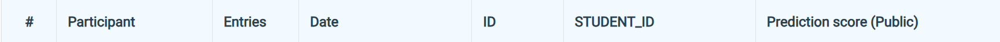
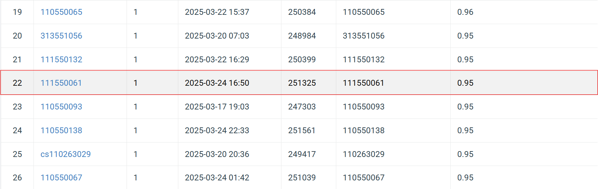

# NYCU Selected Topics in Visual Recognition using Deep Learning HW1
Student ID: 111550061   
Name: 邱冠崴

## Introduction
This is a task to classify images into one of 100 categories. As a requirement, we must use ResNet or its variants as the backbone model. Finally, the prediction results will be submitted to Codabench to evaluate the performance.
In my work, I use ResNeXt-101 (64×4d) as the backbone and experiment with an ensemble approach, specifically bagging, to improve accuracy.

## How to install
### 1. Clone the Repository 
Begin by cloning the repository to your local machine and navigating to the project directory:  
```bash 
git clone https://github.com/GuanWei926/Selected-Topics-in-Visual-Recognition-using-Deep-Learning.git   
cd Selected-Topics-in-Visual-Recognition-using-Deep-Learning/HW1    
```

### 2. Download the dataset 
Use the following command to download the dataset:  
```bash 
wget --no-check-certificate "https://drive.google.com/uc?export=download&id=1fx4Z6xl5b6r4UFkBrn5l0oPEIagZxQ5u" -O hw1-data.tar.gz   
```

### 3. Install Dependencies  
Install the required dependencies using pip:    
```bash 
pip install -r requirements.txt 
```

## How to execute
After downloading the dataset, you do not need to extract it manually. Instead, you can use the "Extract the Compressed Dataset" section available in any of the ```.ipynb``` files to handle extraction automatically. Once the data has been extracted, you do not need to run this section again.
### ResNeXt101_training.ipynb
•   The ResNeXt101_training.ipynb is used to train a single ResNeXt-101 model.  
•   You can execute the notebook sequentially from the first cell to the "Training" section without issues.     
•   A "Plot Learning Curve" section is also included to make you visualize the learning trend and analyze how the model learns over time.   
•   After training, if you want to test the model and save predictions to a CSV file, you can execute the "Testing" section.    
•   A "Plot Confusion Matrix" section is also provided to make you analyze the distribution of your predictions.    
### ResNeXt101_Bagging_training.ipynb
•   The ResNeXt101_Bagging_training.ipynb notebook is used to train multiple ResNeXt-101 models using different subsets of the training data.   
•   You can execute the notebook sequentially from the first cell to the "Training" section without any issues.     
•   For testing, two methods are provided: (1) testing immediately after training (2) testing separately at a later time    
•   In the first method, you can execute "(1) testing after training" section to directly use the trained models stored in the list during training, without manually loading the weights.  
•   In the second method, you can execute "(2) testing directly" section, but you must first load the model weights from the correct path before making predictions.

<### checkpoint directory
ResNeXt101_64x4d_epoch8.pth is the fine-tuned ResNeXt-101 (64x4d) model trained using ResNeXt101_training.ipynb. On Codabench, this model achieves 93% accuracy on the test data.  
ResNeXt101_64x4d_Bagging*.pth are the fine-tuned ResNeXt-101 (64x4d) models trained using ResNeXt101_Bagging_training.ipynb. On Codabench, those models achieve 95% accuracy on the test data.>

## Performance snapshot

