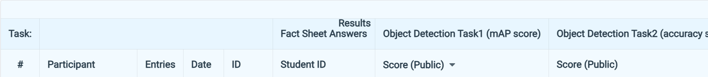
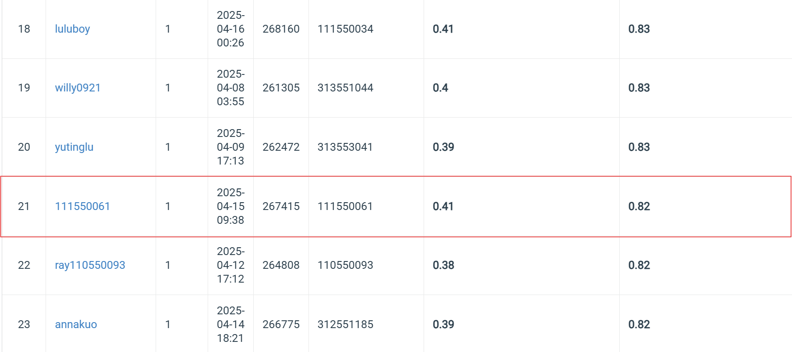

# NYCU Selected Topics in Visual Recognition using Deep Learning HW2
Student ID: 111550061   
Name: 邱冠崴

## Introduction
This assignment consists of two tasks. In the first task, we are required to detect the bounding boxes of digits in each image and record the information in COCO format. In the second task, based on the results from task one, we need to predict the entire digit sequence present in each image. As a constraint, Faster R-CNN must be used to perform the detection. The final predictions will be submitted to Codabench for evaluation.
In my approach, I utilize Faster R-CNN with a ResNet50-FPN v2 backbone and further experiment with an ensemble strategy to enhance accuracy.

## How to install
### 1. Clone the Repository 
Begin by cloning the repository to your local machine and navigating to the project directory:  
```bash 
git clone https://github.com/GuanWei926/Selected-Topics-in-Visual-Recognition-using-Deep-Learning.git   
cd Selected-Topics-in-Visual-Recognition-using-Deep-Learning/HW2    
```

### 2. Download the dataset 
Use the following command to download the dataset:  
```bash 
wget --no-check-certificate "https://drive.google.com/file/d/13JXJ_hIdcloC63sS-vF3wFQLsUP1sMz5/view" -O nycu-hw2-data.tar.gz   
```

### 3. Install Dependencies  
Install the required dependencies using pip:    
```bash 
pip install -r requirements.txt 
```

## How to execute
After downloading the dataset, you do not need to extract it manually. Instead, you can use the "extract the compressed data" section in ```training.ipynb``` to handle extraction automatically. 

To evaluate the accuracy in Task 2, you will need the ground truth CSV file. You can generate this file by executing the "generate ground truth csv file" section. The resulting file will be named valid_label.csv.

Once the data has been extracted and the groud truth csv file is generated, you do not need to run this section again.
### training.ipynb
•   The training.ipynb is used to train a Faster R-CNN model.  
•   You can execute the notebook sequentially from the first cell to the "Training" section without issues.  
•   The get_model() function currently uses fasterrcnn_resnet50_fpn_v2 from torchvision by default. However, you can easily switch to a MobileNet backbone if desired. A version of Faster R-CNN with a VGG16 backbone is also included—just uncomment the corresponding code to use it.  
•   After training, if you want to test the model and save predictions to a json file for task 1 and CSV file for task 2, you can execute the "Testing" section.  
•   A "Test One Image" section is provided to visualize the predicted bounding boxes on a given image.  
•   A "plot the learning curve" section is also included to make you visualize the learning trend and analyze how the model learns over time. Note that you should copy the recorded data from record.csv, which recrods the information while training, into the list provided in this section.  
### ensemble.py
•   The ensemble.py is used to perform Weighted Boxes Fusion (WBF) to combine multiple COCO-format ```.json``` files. It generates a merged ```.json``` file for Task 1, which is then used to create the corresponding ```.csv``` file for Task 2.

•   To use this python file, first create a directory named bagging, and place all the ```.json``` files you wish to merge into this directory. Then, specify the file names in the PRED_FILES list.

•   In the WEIGHTS list, you can assign a weight to each ```.json``` file to control its influence during the Weighted Boxes Fusion process.
### 111550061_HW2.pdf
•  This file is the report for the HW2 assignment. It provides information on the methods, experiments, and results.

## Performance snapshot

