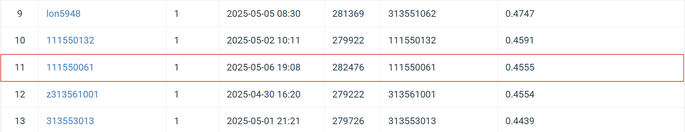
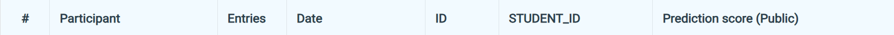

# NYCU Selected Topics in Visual Recognition using Deep Learning HW3
Student ID: 111550061   
Name: 邱冠崴

## Introduction
This assignment focuses on performing cell instance segmentation. As a constraint, Mask R-CNN or any other two-stage models must be used to perform the detection. Moreover, the final predictions must be encoded in RLE (Run-Length Encoding) format and submitted to Codabench for evaluation.

In my approach, I utilize Mask R-CNN with a ResNet-50 FPN v2 backbone, modified to use smaller anchor sizes to better detect small objects. To further enhance accuracy, I conducted additional experiments using an ensemble strategy.


## How to install
### 1. Clone the Repository 
Begin by cloning the repository to your local machine and navigating to the project directory:  
```bash 
git clone https://github.com/GuanWei926/Selected-Topics-in-Visual-Recognition-using-Deep-Learning.git   
cd Selected-Topics-in-Visual-Recognition-using-Deep-Learning/HW3
```

### 2. Download the dataset 
Use the following command to download the dataset:  
```bash 
pip install gdown
gdown 1B0qWNzQZQmfQP7x7o4FDdgb9GvPDoFzI   
```

### 3. Install Dependencies  
Install the required dependencies using pip:    
```bash 
pip install -r requirements.txt 
```

## How to execute
After downloading the dataset, you do not need to extract it manually. Instead, you can use the "extract the compressed data" section in ```Training.ipynb``` to handle extraction automatically. Once completed, create a directory named hw3-data-release and place the extracted content inside it.

Once the data has been extracted, you do not need to run those sections again.
### Training.ipynb
&nbsp;•   The training.ipynb is used to train a Mask R-CNN model.  

•   You can execute the notebook sequentially from the first cell to the "Training" section without issues.  

•   There are several get_model_xxx functions are provided, including:

    get_model_resnet50v2() – Mask R-CNN with a ResNet50-FPN v2 backbone (default),

    get_model_mobilenetv2() – Mask R-CNN with a MobileNetV2 backbone,

    get_model_resnext50() – Mask R-CNN with a ResNeXt50-32x4d backbone.
    
You can choose and execute the section corresponding to the model you want to use.

•   In the "train the model" section, the code currently defaults to using get_model_resnet50v2. If you'd like to switch to a different backbone, please modify the function call manually.

•   The "plot learning curve" section is also included to make you visualize the learning trend and analyze how the model learns over time. You can use the two cells in this section to plot:

    training vs. validation loss

    training vs. validation mAP

•   After training, if you want to test the model and generate predictions in COCO-style RLE format, you can execute the "Testing" section.  

•   In the final "Ensemble" section, you should place all .json prediction files (in RLE format) you wish to combine into a folder named predictions. Next, execute this section then the code will automatically help you to merge all of the .json file into one single ensemble prediction file.

### 111550061_HW3.pdf
•  This file is the report for the HW3 assignment. It provides information on the methods, experiments, and results.

## Performance snapshot


