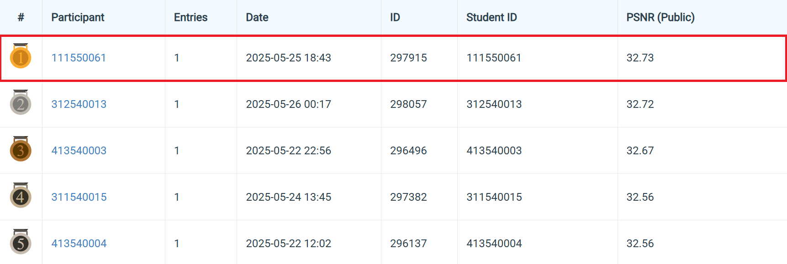
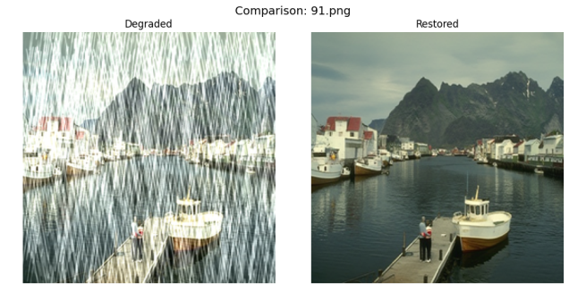
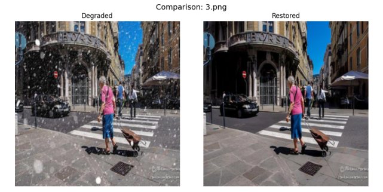

# NYCU Selected Topics in Visual Recognition using Deep Learning HW4
Student ID: 111550061   
Name: 邱冠崴


## Introduction
This assignment focuses on the task of image restoration. As a constraint, PromptIR or other purely vision-based models must be used to perform the restoration. Additionally, the final predictions are required to be saved in .npz format and submitted to Codabench for evaluation.

In my approach, I utilize PromptIR with modifications, including smaller batch sizes and larger patch sizes to help the model better capture fine-grained details. To further improve accuracy, I conducted additional experiments using an ensemble strategy and replaced the original L1 loss with a combined loss function that incorporates L1 loss, SSIM, and perceptual loss based on VGG16 features.


## How to install
### 1. Clone the Repository 
Begin by cloning the repository to your local machine and navigating to the project directory:  
```bash 
git clone https://github.com/GuanWei926/Selected-Topics-in-Visual-Recognition-using-Deep-Learning.git   
cd Selected-Topics-in-Visual-Recognition-using-Deep-Learning/HW4
```

### 2. Download the dataset 
Use the following command to download the dataset and sample code:  
```bash 
pip install gdown
gdown --folder https://drive.google.com/drive/folders/1Q4qLPMCKdjn-iGgXV_8wujDmvDpSI1ul 
```

### 3. Install Dependencies  
Install the required dependencies by re-create the environment:    
```bash 
conda env create -f environment.yaml 
```

## How to execute
After downloading the dataset, manually extract the hw4_realset_dataset.zip file. Then, move the extracted contents into the data directory located within the PromptIR project folder.

Please ensure that the training and testing images are stored separately. Different types of training data should be placed in their corresponding subfolders under Derain or Desnow. Additionally, you must update the .txt files located in each subfolder under the data_dir directory to specify the filenames of the training and validation datasets accordingly.

To execute the following code, you should:
```bash 
cd ./PromptIR 
```

### train.py
&nbsp;•   The training.py is used to train a PromptIR model.    

•   To start training, use the following command in your terminal:
```bash 
python train.py --de_type derain desnow --epochs 450 --num_gpus 2 --batch_size 2 --lr 2e-4 --patch_size 224 
```
You can modify the parameters to experiment with different settings.

### inference.py
•   The inference.py script is used to generate restored images using the trained model.

•   Note: Make sure to update the checkpoint path in line 54 to point to your own trained model.

•   Run the code by using:
```bash 
python inference.py
```

### ensemble.py
•   The ensemble.py script performs ensemble inference by averaging the predictions from multiple model checkpoints.

•   To use it, simply add the paths of the checkpoints you want to combine to the `ckpt_paths` list.

•   Run the code by using:
```bash 
python ensemble.py
```

### visualization.py
•   The visualizatioon.py generates comparison images between the original degraded images and the predicted restored outputs.

•   Note: Update the checkpoint path in line 56 to point to your own trained model.

•   You should also specify the filenames of the test images you want to visualize by editing the `image` list.

•   Run the code by using:
```bash 
python visualization.py
```

### 111550061_HW4.pdf
•  This file is the report for the HW4 assignment. It provides information on the methods, experiments, and results.

## Performance snapshot


## Visualization Result


